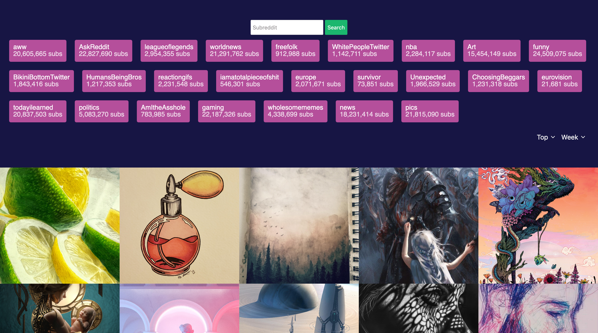

# [Reddit-client](https://ddit.herokuapp.com/)

[](https://travis-ci.org/malcodeman/reddit-client)
[](https://github.com/malcodeman/micro-reddit/blob/master/LICENSE)
[](https://github.com/styled-components/styled-components)
[](https://github.com/prettier/prettier)

Reddit client is content oriented reddit client which aims to show reddit images and videos in most efficient way possible.



## Getting started

First, clone and run the api:

```
git clone https://github.com/malcodeman/micro-reddit.git micro-reddit
cd micro-reddit
yarn install && yarn start
```

Next, you can clone and run the frontend:

```
git clone https://github.com/malcodeman/reddit-client.git reddit-client
cd reddit-client
yarn install && yarn start
```

.env.development.local:

```
REACT_APP_API_URL = "http://localhost:8080"
```

## Design decisions

Why ... ?

- [react-intersection-observer](https://developer.mozilla.org/en-US/docs/Web/API/Intersection_Observer_API)

## Credits

Huge ❤️ to:

- [Luis Merino](https://github.com/Rendez) for his work on react-intersection-observer

## License

[MIT](./LICENSE)
